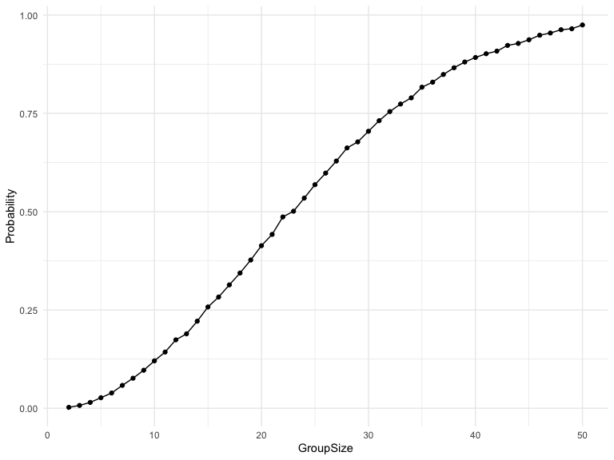
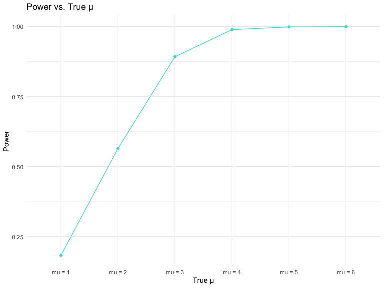
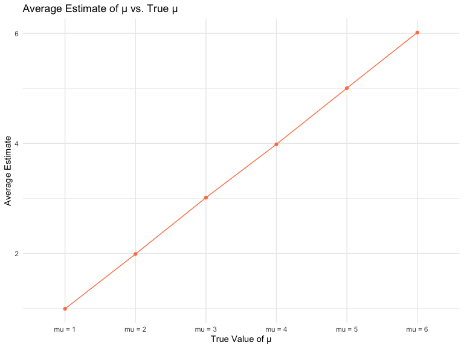
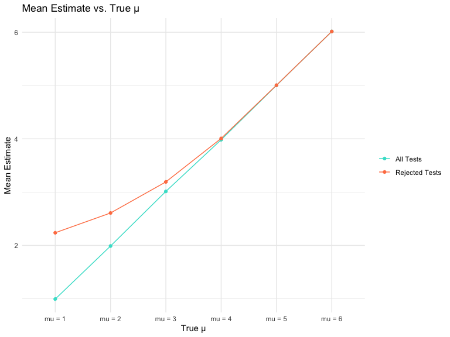
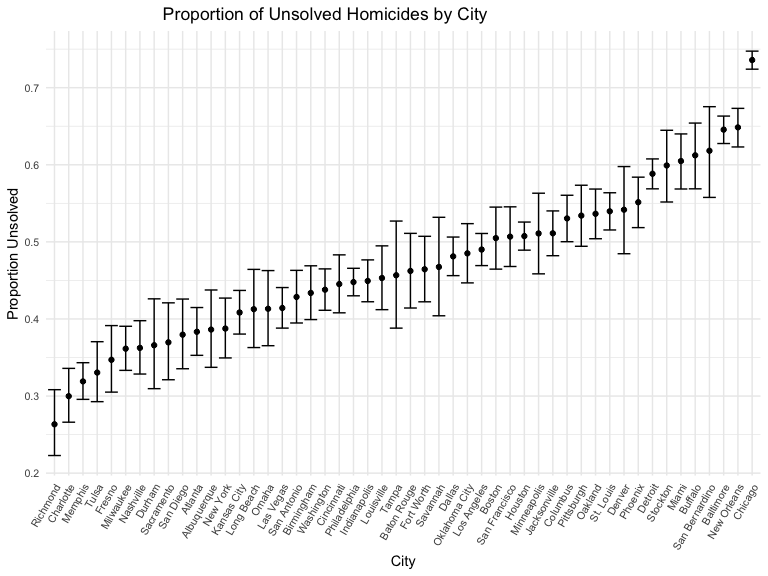

p8105_hw5_qh2285
================
Qianxuan Huang
2024-11-15

``` r
library(tidyverse)
library(dplyr)
library(ggplot2)

knitr::opts_chunk$set(
    warning = FALSE,
    message = FALSE,
    fig.width = 8, 
    fig.height = 6)

theme_set(theme_minimal())
```

## Problem 1

``` r
check_shared_birthday <- function(n) {
  birthdays <- sample(1:365, size = n, replace = TRUE)
  has_duplicates <- any(duplicated(birthdays))  # Check if there are duplicates
  return(has_duplicates)
}

group_sizes <- 2:50
num_simulations <- 10000


set.seed(42)  # For reproducibility
probabilities <- sapply(group_sizes, function(n) {
  mean(replicate(num_simulations, check_shared_birthday(n)))
})

# Plot
plot_data <- data.frame(GroupSize = group_sizes, Probability = probabilities)

ggplot(plot_data, aes(x = GroupSize, y = Probability)) +
  geom_line() +
  geom_point()
```

<!-- -->

``` r
  theme_minimal() +
  labs(
    x = "Group Size",
    y = "Probability of Shared Birthday",
    title = "Probability of Shared Birthdays vs Group Size"
  )
```

    ## List of 138
    ##  $ line                            :List of 6
    ##   ..$ colour       : chr "black"
    ##   ..$ linewidth    : num 0.5
    ##   ..$ linetype     : num 1
    ##   ..$ lineend      : chr "butt"
    ##   ..$ arrow        : logi FALSE
    ##   ..$ inherit.blank: logi TRUE
    ##   ..- attr(*, "class")= chr [1:2] "element_line" "element"
    ##  $ rect                            :List of 5
    ##   ..$ fill         : chr "white"
    ##   ..$ colour       : chr "black"
    ##   ..$ linewidth    : num 0.5
    ##   ..$ linetype     : num 1
    ##   ..$ inherit.blank: logi TRUE
    ##   ..- attr(*, "class")= chr [1:2] "element_rect" "element"
    ##  $ text                            :List of 11
    ##   ..$ family       : chr ""
    ##   ..$ face         : chr "plain"
    ##   ..$ colour       : chr "black"
    ##   ..$ size         : num 11
    ##   ..$ hjust        : num 0.5
    ##   ..$ vjust        : num 0.5
    ##   ..$ angle        : num 0
    ##   ..$ lineheight   : num 0.9
    ##   ..$ margin       : 'margin' num [1:4] 0points 0points 0points 0points
    ##   .. ..- attr(*, "unit")= int 8
    ##   ..$ debug        : logi FALSE
    ##   ..$ inherit.blank: logi TRUE
    ##   ..- attr(*, "class")= chr [1:2] "element_text" "element"
    ##  $ title                           : chr "Probability of Shared Birthdays vs Group Size"
    ##  $ aspect.ratio                    : NULL
    ##  $ axis.title                      : NULL
    ##  $ axis.title.x                    :List of 11
    ##   ..$ family       : NULL
    ##   ..$ face         : NULL
    ##   ..$ colour       : NULL
    ##   ..$ size         : NULL
    ##   ..$ hjust        : NULL
    ##   ..$ vjust        : num 1
    ##   ..$ angle        : NULL
    ##   ..$ lineheight   : NULL
    ##   ..$ margin       : 'margin' num [1:4] 2.75points 0points 0points 0points
    ##   .. ..- attr(*, "unit")= int 8
    ##   ..$ debug        : NULL
    ##   ..$ inherit.blank: logi TRUE
    ##   ..- attr(*, "class")= chr [1:2] "element_text" "element"
    ##  $ axis.title.x.top                :List of 11
    ##   ..$ family       : NULL
    ##   ..$ face         : NULL
    ##   ..$ colour       : NULL
    ##   ..$ size         : NULL
    ##   ..$ hjust        : NULL
    ##   ..$ vjust        : num 0
    ##   ..$ angle        : NULL
    ##   ..$ lineheight   : NULL
    ##   ..$ margin       : 'margin' num [1:4] 0points 0points 2.75points 0points
    ##   .. ..- attr(*, "unit")= int 8
    ##   ..$ debug        : NULL
    ##   ..$ inherit.blank: logi TRUE
    ##   ..- attr(*, "class")= chr [1:2] "element_text" "element"
    ##  $ axis.title.x.bottom             : NULL
    ##  $ axis.title.y                    :List of 11
    ##   ..$ family       : NULL
    ##   ..$ face         : NULL
    ##   ..$ colour       : NULL
    ##   ..$ size         : NULL
    ##   ..$ hjust        : NULL
    ##   ..$ vjust        : num 1
    ##   ..$ angle        : num 90
    ##   ..$ lineheight   : NULL
    ##   ..$ margin       : 'margin' num [1:4] 0points 2.75points 0points 0points
    ##   .. ..- attr(*, "unit")= int 8
    ##   ..$ debug        : NULL
    ##   ..$ inherit.blank: logi TRUE
    ##   ..- attr(*, "class")= chr [1:2] "element_text" "element"
    ##  $ axis.title.y.left               : NULL
    ##  $ axis.title.y.right              :List of 11
    ##   ..$ family       : NULL
    ##   ..$ face         : NULL
    ##   ..$ colour       : NULL
    ##   ..$ size         : NULL
    ##   ..$ hjust        : NULL
    ##   ..$ vjust        : num 1
    ##   ..$ angle        : num -90
    ##   ..$ lineheight   : NULL
    ##   ..$ margin       : 'margin' num [1:4] 0points 0points 0points 2.75points
    ##   .. ..- attr(*, "unit")= int 8
    ##   ..$ debug        : NULL
    ##   ..$ inherit.blank: logi TRUE
    ##   ..- attr(*, "class")= chr [1:2] "element_text" "element"
    ##  $ axis.text                       :List of 11
    ##   ..$ family       : NULL
    ##   ..$ face         : NULL
    ##   ..$ colour       : chr "grey30"
    ##   ..$ size         : 'rel' num 0.8
    ##   ..$ hjust        : NULL
    ##   ..$ vjust        : NULL
    ##   ..$ angle        : NULL
    ##   ..$ lineheight   : NULL
    ##   ..$ margin       : NULL
    ##   ..$ debug        : NULL
    ##   ..$ inherit.blank: logi TRUE
    ##   ..- attr(*, "class")= chr [1:2] "element_text" "element"
    ##  $ axis.text.x                     :List of 11
    ##   ..$ family       : NULL
    ##   ..$ face         : NULL
    ##   ..$ colour       : NULL
    ##   ..$ size         : NULL
    ##   ..$ hjust        : NULL
    ##   ..$ vjust        : num 1
    ##   ..$ angle        : NULL
    ##   ..$ lineheight   : NULL
    ##   ..$ margin       : 'margin' num [1:4] 2.2points 0points 0points 0points
    ##   .. ..- attr(*, "unit")= int 8
    ##   ..$ debug        : NULL
    ##   ..$ inherit.blank: logi TRUE
    ##   ..- attr(*, "class")= chr [1:2] "element_text" "element"
    ##  $ axis.text.x.top                 :List of 11
    ##   ..$ family       : NULL
    ##   ..$ face         : NULL
    ##   ..$ colour       : NULL
    ##   ..$ size         : NULL
    ##   ..$ hjust        : NULL
    ##   ..$ vjust        : num 0
    ##   ..$ angle        : NULL
    ##   ..$ lineheight   : NULL
    ##   ..$ margin       : 'margin' num [1:4] 0points 0points 2.2points 0points
    ##   .. ..- attr(*, "unit")= int 8
    ##   ..$ debug        : NULL
    ##   ..$ inherit.blank: logi TRUE
    ##   ..- attr(*, "class")= chr [1:2] "element_text" "element"
    ##  $ axis.text.x.bottom              : NULL
    ##  $ axis.text.y                     :List of 11
    ##   ..$ family       : NULL
    ##   ..$ face         : NULL
    ##   ..$ colour       : NULL
    ##   ..$ size         : NULL
    ##   ..$ hjust        : num 1
    ##   ..$ vjust        : NULL
    ##   ..$ angle        : NULL
    ##   ..$ lineheight   : NULL
    ##   ..$ margin       : 'margin' num [1:4] 0points 2.2points 0points 0points
    ##   .. ..- attr(*, "unit")= int 8
    ##   ..$ debug        : NULL
    ##   ..$ inherit.blank: logi TRUE
    ##   ..- attr(*, "class")= chr [1:2] "element_text" "element"
    ##  $ axis.text.y.left                : NULL
    ##  $ axis.text.y.right               :List of 11
    ##   ..$ family       : NULL
    ##   ..$ face         : NULL
    ##   ..$ colour       : NULL
    ##   ..$ size         : NULL
    ##   ..$ hjust        : num 0
    ##   ..$ vjust        : NULL
    ##   ..$ angle        : NULL
    ##   ..$ lineheight   : NULL
    ##   ..$ margin       : 'margin' num [1:4] 0points 0points 0points 2.2points
    ##   .. ..- attr(*, "unit")= int 8
    ##   ..$ debug        : NULL
    ##   ..$ inherit.blank: logi TRUE
    ##   ..- attr(*, "class")= chr [1:2] "element_text" "element"
    ##  $ axis.text.theta                 : NULL
    ##  $ axis.text.r                     :List of 11
    ##   ..$ family       : NULL
    ##   ..$ face         : NULL
    ##   ..$ colour       : NULL
    ##   ..$ size         : NULL
    ##   ..$ hjust        : num 0.5
    ##   ..$ vjust        : NULL
    ##   ..$ angle        : NULL
    ##   ..$ lineheight   : NULL
    ##   ..$ margin       : 'margin' num [1:4] 0points 2.2points 0points 2.2points
    ##   .. ..- attr(*, "unit")= int 8
    ##   ..$ debug        : NULL
    ##   ..$ inherit.blank: logi TRUE
    ##   ..- attr(*, "class")= chr [1:2] "element_text" "element"
    ##  $ axis.ticks                      : list()
    ##   ..- attr(*, "class")= chr [1:2] "element_blank" "element"
    ##  $ axis.ticks.x                    : NULL
    ##  $ axis.ticks.x.top                : NULL
    ##  $ axis.ticks.x.bottom             : NULL
    ##  $ axis.ticks.y                    : NULL
    ##  $ axis.ticks.y.left               : NULL
    ##  $ axis.ticks.y.right              : NULL
    ##  $ axis.ticks.theta                : NULL
    ##  $ axis.ticks.r                    : NULL
    ##  $ axis.minor.ticks.x.top          : NULL
    ##  $ axis.minor.ticks.x.bottom       : NULL
    ##  $ axis.minor.ticks.y.left         : NULL
    ##  $ axis.minor.ticks.y.right        : NULL
    ##  $ axis.minor.ticks.theta          : NULL
    ##  $ axis.minor.ticks.r              : NULL
    ##  $ axis.ticks.length               : 'simpleUnit' num 2.75points
    ##   ..- attr(*, "unit")= int 8
    ##  $ axis.ticks.length.x             : NULL
    ##  $ axis.ticks.length.x.top         : NULL
    ##  $ axis.ticks.length.x.bottom      : NULL
    ##  $ axis.ticks.length.y             : NULL
    ##  $ axis.ticks.length.y.left        : NULL
    ##  $ axis.ticks.length.y.right       : NULL
    ##  $ axis.ticks.length.theta         : NULL
    ##  $ axis.ticks.length.r             : NULL
    ##  $ axis.minor.ticks.length         : 'rel' num 0.75
    ##  $ axis.minor.ticks.length.x       : NULL
    ##  $ axis.minor.ticks.length.x.top   : NULL
    ##  $ axis.minor.ticks.length.x.bottom: NULL
    ##  $ axis.minor.ticks.length.y       : NULL
    ##  $ axis.minor.ticks.length.y.left  : NULL
    ##  $ axis.minor.ticks.length.y.right : NULL
    ##  $ axis.minor.ticks.length.theta   : NULL
    ##  $ axis.minor.ticks.length.r       : NULL
    ##  $ axis.line                       : list()
    ##   ..- attr(*, "class")= chr [1:2] "element_blank" "element"
    ##  $ axis.line.x                     : NULL
    ##  $ axis.line.x.top                 : NULL
    ##  $ axis.line.x.bottom              : NULL
    ##  $ axis.line.y                     : NULL
    ##  $ axis.line.y.left                : NULL
    ##  $ axis.line.y.right               : NULL
    ##  $ axis.line.theta                 : NULL
    ##  $ axis.line.r                     : NULL
    ##  $ legend.background               : list()
    ##   ..- attr(*, "class")= chr [1:2] "element_blank" "element"
    ##  $ legend.margin                   : 'margin' num [1:4] 5.5points 5.5points 5.5points 5.5points
    ##   ..- attr(*, "unit")= int 8
    ##  $ legend.spacing                  : 'simpleUnit' num 11points
    ##   ..- attr(*, "unit")= int 8
    ##  $ legend.spacing.x                : NULL
    ##  $ legend.spacing.y                : NULL
    ##  $ legend.key                      : list()
    ##   ..- attr(*, "class")= chr [1:2] "element_blank" "element"
    ##  $ legend.key.size                 : 'simpleUnit' num 1.2lines
    ##   ..- attr(*, "unit")= int 3
    ##  $ legend.key.height               : NULL
    ##  $ legend.key.width                : NULL
    ##  $ legend.key.spacing              : 'simpleUnit' num 5.5points
    ##   ..- attr(*, "unit")= int 8
    ##  $ legend.key.spacing.x            : NULL
    ##  $ legend.key.spacing.y            : NULL
    ##  $ legend.frame                    : NULL
    ##  $ legend.ticks                    : NULL
    ##  $ legend.ticks.length             : 'rel' num 0.2
    ##  $ legend.axis.line                : NULL
    ##  $ legend.text                     :List of 11
    ##   ..$ family       : NULL
    ##   ..$ face         : NULL
    ##   ..$ colour       : NULL
    ##   ..$ size         : 'rel' num 0.8
    ##   ..$ hjust        : NULL
    ##   ..$ vjust        : NULL
    ##   ..$ angle        : NULL
    ##   ..$ lineheight   : NULL
    ##   ..$ margin       : NULL
    ##   ..$ debug        : NULL
    ##   ..$ inherit.blank: logi TRUE
    ##   ..- attr(*, "class")= chr [1:2] "element_text" "element"
    ##  $ legend.text.position            : NULL
    ##  $ legend.title                    :List of 11
    ##   ..$ family       : NULL
    ##   ..$ face         : NULL
    ##   ..$ colour       : NULL
    ##   ..$ size         : NULL
    ##   ..$ hjust        : num 0
    ##   ..$ vjust        : NULL
    ##   ..$ angle        : NULL
    ##   ..$ lineheight   : NULL
    ##   ..$ margin       : NULL
    ##   ..$ debug        : NULL
    ##   ..$ inherit.blank: logi TRUE
    ##   ..- attr(*, "class")= chr [1:2] "element_text" "element"
    ##  $ legend.title.position           : NULL
    ##  $ legend.position                 : chr "right"
    ##  $ legend.position.inside          : NULL
    ##  $ legend.direction                : NULL
    ##  $ legend.byrow                    : NULL
    ##  $ legend.justification            : chr "center"
    ##  $ legend.justification.top        : NULL
    ##  $ legend.justification.bottom     : NULL
    ##  $ legend.justification.left       : NULL
    ##  $ legend.justification.right      : NULL
    ##  $ legend.justification.inside     : NULL
    ##  $ legend.location                 : NULL
    ##  $ legend.box                      : NULL
    ##  $ legend.box.just                 : NULL
    ##  $ legend.box.margin               : 'margin' num [1:4] 0cm 0cm 0cm 0cm
    ##   ..- attr(*, "unit")= int 1
    ##  $ legend.box.background           : list()
    ##   ..- attr(*, "class")= chr [1:2] "element_blank" "element"
    ##  $ legend.box.spacing              : 'simpleUnit' num 11points
    ##   ..- attr(*, "unit")= int 8
    ##   [list output truncated]
    ##  - attr(*, "class")= chr [1:2] "theme" "gg"
    ##  - attr(*, "complete")= logi TRUE
    ##  - attr(*, "validate")= logi TRUE

Probability of shared birthdays grows when group size grows, and the
tendency shows a “S” shape. Larger the group size, the probability tends
to 1.

## Problem 2

``` r
# Set Up the Simulation
n = 30
sigma = 5
mu = 0:6
num_simulations = 5000
alpha = 0.05

simulate_t_test <- function(mu, n, sigma) 
 {
  sample <- rnorm(n, mean = mu, sd = sigma)
  test_result <- t.test(sample, mu = 0, conf.level = 0.95)
  tidy_result <- broom::tidy(test_result) %>%
    rename(mu_hat = estimate, p_value = p.value)
    return(tidy_result[c("mu_hat", "p_value")])
}

# Perform One-Sample t-Test
simulation_results <- map_dfr(1:num_simulations, ~simulate_t_test(mu, n, sigma))

head(simulation_results)
```

    ## # A tibble: 6 × 2
    ##   mu_hat p_value
    ##    <dbl>   <dbl>
    ## 1  3.15  0.0173 
    ## 2  3.52  0.00198
    ## 3  2.17  0.0214 
    ## 4  0.772 0.469  
    ## 5  3.14  0.00547
    ## 6  1.28  0.126

``` r
# Calculate Power and Average Estimates
mu_list =
  list(
    "mu = 1" = 1,
    "mu = 2" = 2,
    "mu = 3" = 3,
    "mu = 4" = 4,
    "mu = 5" = 5,
    "mu = 6" = 6
  )

results <- map_df(mu_list, function(mu) {
  map_dfr(1:num_simulations, ~simulate_t_test(mu, n, sigma))
}, .id = "mu")

results %>%
  mutate(mu = as.numeric(str_extract(results$mu, "\\d+")))
```

    ## # A tibble: 30,000 × 3
    ##       mu  mu_hat p_value
    ##    <dbl>   <dbl>   <dbl>
    ##  1     1 -0.532  0.589  
    ##  2     1 -0.768  0.431  
    ##  3     1  1.20   0.171  
    ##  4     1  2.01   0.0304 
    ##  5     1  0.909  0.328  
    ##  6     1  2.52   0.00724
    ##  7     1  0.0980 0.890  
    ##  8     1 -0.300  0.749  
    ##  9     1  0.402  0.748  
    ## 10     1  1.28   0.256  
    ## # ℹ 29,990 more rows

``` r
power_results <- results %>%
  group_by(mu) %>%
  summarise(
    power = mean(p_value < alpha),
    mean_mu_hat = mean(mu_hat),
    mean_mu_rejected = mean(mu_hat[p_value < alpha])
  ) %>%
  ungroup()

# Power plot
power_results %>%
  ggplot(aes(x = mu, y = power, group = 1)) +
  geom_point(color = "turquoise") +
  geom_line(color = "turquoise") +
  labs(title = "Power vs. True µ", 
       x = "True µ", 
       y = "Power")
```

<!-- --> The
graph shows that the power of the test grows when μ increases,
demonstrating that greater effect sizes correspond to enhanced power.
But there is an observable leveling off in power at higher effect sizes,
indicating a threshold beyond which additional increases in effect size
do not substantially improve the power of the test.

``` r
# Estimate plot
power_results %>%
  ggplot(aes(x = mu, y = mean_mu_hat, group = 1)) +
  geom_point(color = "coral") +
  geom_line(color = "coral") +
  labs(title = "Average Estimate of µ vs. True µ", 
       x = "True Value of µ", 
       y = "Average Estimate")
```

<!-- -->

``` r
power_results %>%
  ggplot(aes(x = mu)) +
  geom_point(aes(y = mean_mu_hat, group = 1, color = "All Tests")) +
  geom_line(aes(y = mean_mu_hat, group = 1, color = "All Tests")) +
  geom_point(aes(y = mean_mu_rejected, group = 1, color = "Rejected Tests")) +
  geom_line(aes(y = mean_mu_rejected, group = 1, color = "Rejected Tests"))  +
  scale_color_manual(labels = c("All Tests", "Rejected Tests"), 
                     values = c("turquoise", "coral")) +
  labs(title = "Mean Estimate vs. True µ", 
       x = "True µ", 
       y = "Mean Estimate") +
  theme(legend.title = element_blank())
```

<!-- --> As
the true value of μ grows, the average of the sample estimates μ_hat in
tests where the null hypothesis is rejected increasingly aligns with the
true μ.

Explanation: When μ is relatively small, samples showing a significantly
higher μ_hat than the true μ are more likely to lead to the rejection of
the null hypothesis, resulting in a higher mean of μ_hat compared to μ.
However, as μ increases, samples where μ_hat is closer to μ are more
frequently associated with null hypothesis rejections, leading to the
mean of μ_hat becoming progressively closer to the true μ.

## Problem 3

Load the Data:

``` r
homicide = read_csv("./data/homicide-data.csv") |> 
            janitor::clean_names()
```

The `homicide` dataset includes data on homicide incidents in the United
States spanning from 2007 to 2017. It is comprised of 52179 rows and 12
columns.

**Variables**:

- `uid`: unique identifier

- `reported_date`: date of homicide accident

- `victim_last`: last name of victim

- `victim_first`: first name of victim

- `victim_race`: race name of victim

- `victim_age`: age name of victim

- `victim_sex`: sex name of victim

- `city`: city location of homicide accident

- `state`: state location of homicide accident

- `lat`: latitude location of homicide accident

- `lon`: longitude location of homicide accident

- `disposition`: disposition outcome of homicide accident

Data Manipulation:

``` r
homicide = homicide|>
  mutate(
    city_state = str_c(city, ", ", state)
    )

homicide |> 
        group_by(city) |>
        summarise(count = n()) |>
        knitr::kable(caption = "Total number of homicides")
```

| city           | count |
|:---------------|------:|
| Albuquerque    |   378 |
| Atlanta        |   973 |
| Baltimore      |  2827 |
| Baton Rouge    |   424 |
| Birmingham     |   800 |
| Boston         |   614 |
| Buffalo        |   521 |
| Charlotte      |   687 |
| Chicago        |  5535 |
| Cincinnati     |   694 |
| Columbus       |  1084 |
| Dallas         |  1567 |
| Denver         |   312 |
| Detroit        |  2519 |
| Durham         |   276 |
| Fort Worth     |   549 |
| Fresno         |   487 |
| Houston        |  2942 |
| Indianapolis   |  1322 |
| Jacksonville   |  1168 |
| Kansas City    |  1190 |
| Las Vegas      |  1381 |
| Long Beach     |   378 |
| Los Angeles    |  2257 |
| Louisville     |   576 |
| Memphis        |  1514 |
| Miami          |   744 |
| Milwaukee      |  1115 |
| Minneapolis    |   366 |
| Nashville      |   767 |
| New Orleans    |  1434 |
| New York       |   627 |
| Oakland        |   947 |
| Oklahoma City  |   672 |
| Omaha          |   409 |
| Philadelphia   |  3037 |
| Phoenix        |   914 |
| Pittsburgh     |   631 |
| Richmond       |   429 |
| Sacramento     |   376 |
| San Antonio    |   833 |
| San Bernardino |   275 |
| San Diego      |   461 |
| San Francisco  |   663 |
| Savannah       |   246 |
| St. Louis      |  1677 |
| Stockton       |   444 |
| Tampa          |   208 |
| Tulsa          |   584 |
| Washington     |  1345 |

Total number of homicides

``` r
unsolved_homicides = c("Closed without arrest", "Open/No arrest")
homicide |>
        filter(disposition %in% unsolved_homicides) |>
        group_by(city) |>
        summarise(unsolved_count = n()) |>
        knitr::kable(caption = "Total number of unsolved homicides")
```

| city           | unsolved_count |
|:---------------|---------------:|
| Albuquerque    |            146 |
| Atlanta        |            373 |
| Baltimore      |           1825 |
| Baton Rouge    |            196 |
| Birmingham     |            347 |
| Boston         |            310 |
| Buffalo        |            319 |
| Charlotte      |            206 |
| Chicago        |           4073 |
| Cincinnati     |            309 |
| Columbus       |            575 |
| Dallas         |            754 |
| Denver         |            169 |
| Detroit        |           1482 |
| Durham         |            101 |
| Fort Worth     |            255 |
| Fresno         |            169 |
| Houston        |           1493 |
| Indianapolis   |            594 |
| Jacksonville   |            597 |
| Kansas City    |            486 |
| Las Vegas      |            572 |
| Long Beach     |            156 |
| Los Angeles    |           1106 |
| Louisville     |            261 |
| Memphis        |            483 |
| Miami          |            450 |
| Milwaukee      |            403 |
| Minneapolis    |            187 |
| Nashville      |            278 |
| New Orleans    |            930 |
| New York       |            243 |
| Oakland        |            508 |
| Oklahoma City  |            326 |
| Omaha          |            169 |
| Philadelphia   |           1360 |
| Phoenix        |            504 |
| Pittsburgh     |            337 |
| Richmond       |            113 |
| Sacramento     |            139 |
| San Antonio    |            357 |
| San Bernardino |            170 |
| San Diego      |            175 |
| San Francisco  |            336 |
| Savannah       |            115 |
| St. Louis      |            905 |
| Stockton       |            266 |
| Tampa          |             95 |
| Tulsa          |            193 |
| Washington     |            589 |

Total number of unsolved homicides

Proportion Test for Baltimore, MD:

``` r
baltimore = homicide |>
  filter(city_state == "Baltimore, MD") |>
   mutate(unsolved = if_else(disposition %in% unsolved_homicides, 1, 0))

prop_test_bal = prop.test(sum(baltimore$unsolved), nrow(baltimore))
prop_test_df = broom::tidy(prop_test_bal)
```

Estimated Proportion: 0.6455607 Confidence Interval: (0.6275625,
0.6631599)

Proportion Test for All Cities:

``` r
tidy = function(city_name, df){
        city_data = df |> 
                filter(city == city_name) |> 
                mutate(unsolved = if_else(disposition %in% unsolved_homicides, 1, 0))
        prop_test_obj = prop.test(sum(city_data$unsolved), nrow(city_data))
        prop_test_df = broom::tidy(prop_test_obj)
        
        tibble(
                estimate_prop = prop_test_df$estimate,
                conf_low = prop_test_df$conf.low,
                conf_high = prop_test_df$conf.high
        )
}
```

``` r
cities = homicide$city |> unique()
test_result = tibble(
        city = cities,
        hypo_test = map(cities, tidy, df = homicide)
        ) |> 
        unnest(hypo_test)
test_result |> knitr::kable(caption = "Estimated proportion and CI of unsolved homicides")
```

| city           | estimate_prop |  conf_low | conf_high |
|:---------------|--------------:|----------:|----------:|
| Albuquerque    |     0.3862434 | 0.3372604 | 0.4375766 |
| Atlanta        |     0.3833505 | 0.3528119 | 0.4148219 |
| Baltimore      |     0.6455607 | 0.6275625 | 0.6631599 |
| Baton Rouge    |     0.4622642 | 0.4141987 | 0.5110240 |
| Birmingham     |     0.4337500 | 0.3991889 | 0.4689557 |
| Boston         |     0.5048860 | 0.4646219 | 0.5450881 |
| Buffalo        |     0.6122841 | 0.5687990 | 0.6540879 |
| Charlotte      |     0.2998544 | 0.2660820 | 0.3358999 |
| Chicago        |     0.7358627 | 0.7239959 | 0.7473998 |
| Cincinnati     |     0.4452450 | 0.4079606 | 0.4831439 |
| Columbus       |     0.5304428 | 0.5002167 | 0.5604506 |
| Dallas         |     0.4811742 | 0.4561942 | 0.5062475 |
| Denver         |     0.5416667 | 0.4846098 | 0.5976807 |
| Detroit        |     0.5883287 | 0.5687903 | 0.6075953 |
| Durham         |     0.3659420 | 0.3095874 | 0.4260936 |
| Fort Worth     |     0.4644809 | 0.4222542 | 0.5072119 |
| Fresno         |     0.3470226 | 0.3051013 | 0.3913963 |
| Houston        |     0.5074779 | 0.4892447 | 0.5256914 |
| Indianapolis   |     0.4493192 | 0.4223156 | 0.4766207 |
| Jacksonville   |     0.5111301 | 0.4820460 | 0.5401402 |
| Kansas City    |     0.4084034 | 0.3803996 | 0.4370054 |
| Las Vegas      |     0.4141926 | 0.3881284 | 0.4407395 |
| Long Beach     |     0.4126984 | 0.3629026 | 0.4642973 |
| Los Angeles    |     0.4900310 | 0.4692208 | 0.5108754 |
| Louisville     |     0.4531250 | 0.4120609 | 0.4948235 |
| Memphis        |     0.3190225 | 0.2957047 | 0.3432691 |
| Miami          |     0.6048387 | 0.5685783 | 0.6400015 |
| Milwaukee      |     0.3614350 | 0.3333172 | 0.3905194 |
| Minneapolis    |     0.5109290 | 0.4585150 | 0.5631099 |
| Nashville      |     0.3624511 | 0.3285592 | 0.3977401 |
| New Orleans    |     0.6485356 | 0.6231048 | 0.6731615 |
| New York       |     0.3875598 | 0.3494421 | 0.4270755 |
| Oakland        |     0.5364308 | 0.5040588 | 0.5685037 |
| Oklahoma City  |     0.4851190 | 0.4467861 | 0.5236245 |
| Omaha          |     0.4132029 | 0.3653146 | 0.4627477 |
| Philadelphia   |     0.4478103 | 0.4300380 | 0.4657157 |
| Phoenix        |     0.5514223 | 0.5184825 | 0.5839244 |
| Pittsburgh     |     0.5340729 | 0.4942706 | 0.5734545 |
| Richmond       |     0.2634033 | 0.2228571 | 0.3082658 |
| San Antonio    |     0.4285714 | 0.3947772 | 0.4630331 |
| Sacramento     |     0.3696809 | 0.3211559 | 0.4209131 |
| Savannah       |     0.4674797 | 0.4041252 | 0.5318665 |
| San Bernardino |     0.6181818 | 0.5576628 | 0.6753422 |
| San Diego      |     0.3796095 | 0.3354259 | 0.4258315 |
| San Francisco  |     0.5067873 | 0.4680516 | 0.5454433 |
| St. Louis      |     0.5396541 | 0.5154369 | 0.5636879 |
| Stockton       |     0.5990991 | 0.5517145 | 0.6447418 |
| Tampa          |     0.4567308 | 0.3881009 | 0.5269851 |
| Tulsa          |     0.3304795 | 0.2927201 | 0.3705039 |
| Washington     |     0.4379182 | 0.4112495 | 0.4649455 |

Estimated proportion and CI of unsolved homicides

Creating the Plot:

``` r
test_result |>
  mutate(city = fct_reorder(city, estimate_prop)) |>
        ggplot(aes(x = city, y = estimate_prop), width = 100) +
        geom_point() +
        geom_errorbar(aes(ymin = conf_low, ymax = conf_high)) +
        theme_bw() +
        labs(x = "City", y = "Proportion Unsolved", title = "Proportion of Unsolved Homicides by City") +
  theme_minimal() +
        theme(plot.title = element_text(hjust = 0.3),
              axis.text.x = element_text(angle = 60, hjust = 1),
              axis.text = element_text(size = 8) )
```

<!-- -->
